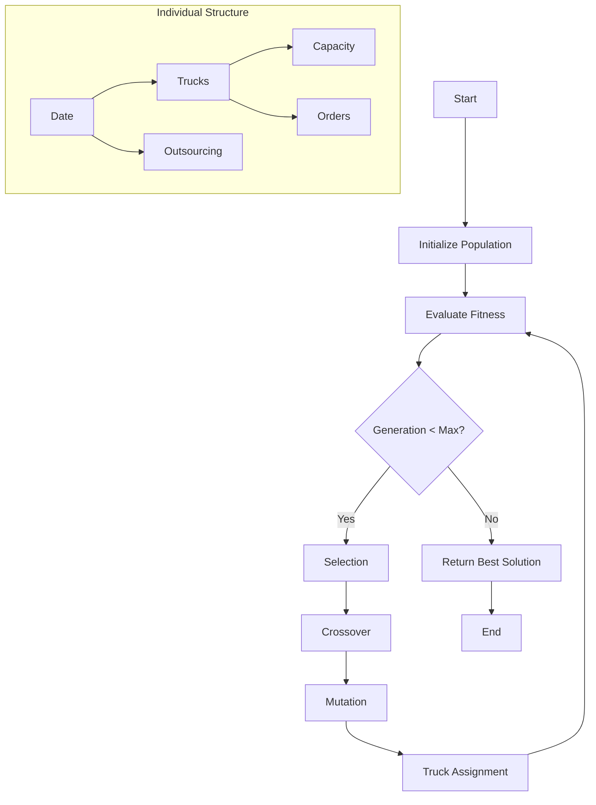
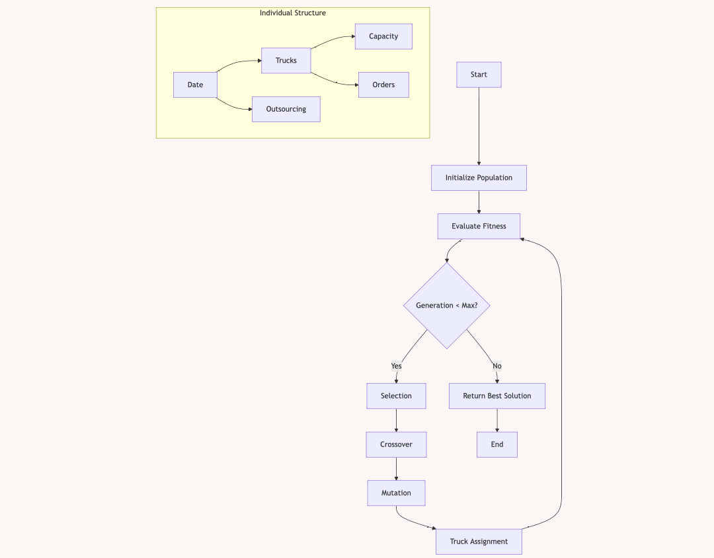

# Genetic Algorithm for Vehicle Routing Problem

This implementation uses a genetic algorithm to solve a complex Vehicle Routing Problem (VRP) with time windows, multiple vehicles, and outsourcing options. The algorithm optimizes delivery routes while considering vehicle capacity constraints, delivery time windows, and outsourcing costs.

## Flow Diagram





## Key Components

### Data Structure
- `warehouse_location`: Central depot coordinates
- `Truck_weights`: List of vehicle capacities
- `order_data`: Customer orders with delivery windows
- `product_list`: Product weights and details

### Main Functions

1. `gen_individual(order_data_w, truck_weights)`
   - Generates a random initial solution
   - Assigns orders to either trucks or outsourcing
   - Respects delivery date windows

2. `crossover(individual1, individual2, order_data_w)`
   - Exchanges outsourced orders between two solutions
   - Preserves feasibility of delivery windows
   - Maintains capacity constraints

3. `mutate(individual, order_data_w, mutation_rate, time_matrix)`
   - Performs random modifications:
     - Moves orders between trucks
     - Transfers orders to/from outsourcing
     - Adds depot visits (0s) to routes
   - Respects time windows and capacity constraints

4. `assign_to_truck(individual, order_data_w, time_matrix)`
   - Attempts to move outsourced orders to available trucks
   - Checks capacity and time constraints
   - Optimizes truck utilization

### Optimization Process

1. **Initialization**
   - Creates initial population of random solutions
   - Each solution contains daily routes for all trucks

2. **Evolution**
   - Selection: Keeps elite solutions and some random ones
   - Crossover: Combines good solutions
   - Mutation: Introduces variation
   - Truck Assignment: Optimizes vehicle utilization

3. **Fitness Evaluation**
   - Considers:
     - `out_source_fee` : out-sourcing cost
     - `wait_time` : total waiting time of every order when reach earlier
     - `outsource_score` : distribution of outsource decision

## Usage

```python
best_solution = optimize_routes(
    order_data_w,        # Order data with weights
    distance_matrix,     # Distance matrix between locations
    time_matrix,        # Travel time matrix
    truck_weights,      # List of truck capacities
    pop_size=1250,      # Population size
    elite_size=125,     # Number of elite solutions
    mutation_rate=0.05, # Mutation probability
    generations=50      # Number of generations
)
```

## Output

The algorithm produces:
1. Optimized routes for each truck on each day
2. List of outsourced deliveries
3. Total cost breakdown
4. Visual route map using OSM
5. Detailed Excel report with schedules

## Visualization

The solution includes:
- Route visualization using OpenStreetMap
- Excel output with detailed schedules
- Time and capacity utilization reports

## Dependencies

- `copy`: Deep copying of solutions
- `random`: Random operations
- `time`: Performance measurement
- `concurrent.futures`: Parallel processing
- Custom modules:
  - `func`: Utility functions
  - `osm`: Map visualization

## Performance Optimization

- Parallel mutation using ThreadPoolExecutor
- Caching of fitness evaluations
- Efficient deep copying mechanisms
- Smart route modification strategies

## Notes

- The algorithm balances between:
  - Route optimization
  - Vehicle capacity utilization
  - Delivery time windows
  - Outsourcing costs
- Solutions are continuously improved through generations
- Elite preservation ensures solution quality
- Random elements maintain population diversity
